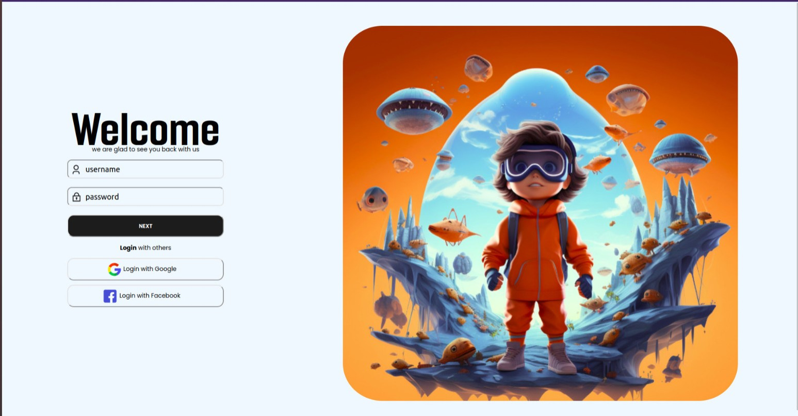

# Login Page Design

This project showcases a login page design created using HTML and CSS. The design is a trial to test and demonstrate knowledge in HTML and CSS, particularly using Flexbox.

## Project Overview

The design was inspired by a Figma design to replicate and learn from a professional layout. The primary goal was to implement a responsive and aesthetically pleasing login page using modern CSS techniques.

## Figma Design

The design was based on the Figma layout available at [Figma Design Link](https://www.figma.com/community/file/1289252438434450753/minimal-login-page-ui-design).

## Preview



## Installation

To view the design locally, you can clone this repository and open the HTML file in a web browser:

```bash
git clone https://github.com/Ahmed122000/Login-Page.git
cd your-repository/html
```
Open login-page.html in your preferred web browser.
